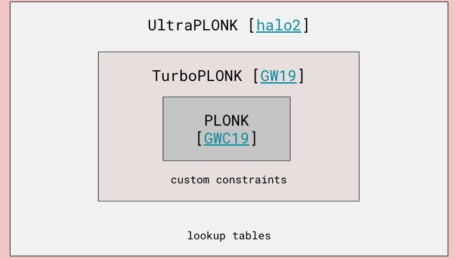
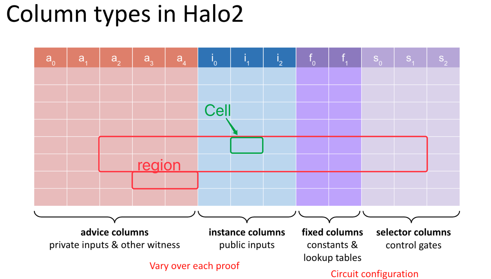
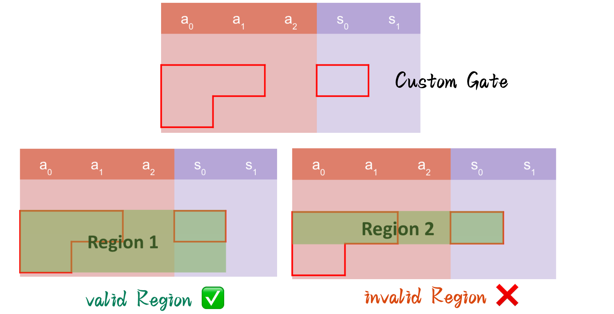

> - 作者:  [@Demian](https://github.com/demian101)
> - 时间: 2023-10-19
> - 校对: [@Po](https://github.com/dajuguan)

### 电路结构

在 [Vanilla PLONK 协议](https://learn.z2o-k7e.world/plonk-intro-cn/plonk-intro.html) 中，门约束系统相对固定和局限：
$$f(x)=Q_L(x) \cdot a(x)+Q_R(x)\cdot b(x)+Q_O(x)\cdot c(x)+Q_M(x)\cdot a(x) b(x)+Q_C(x)$$
在 Halo2 中引入了 custom gate 和 lookup table，约束系统中的约束并不限定在一行上的变量，且 "custom gate" 可以任意指定约束需要的计算。 [^1]



如下图可以看到：电路由列（`Column`）和行（`Row`）组成，行和列的组合可以构成 `region`。其中
列又分为三种类型：`advice`，`instance` 和 `selector` 
下面我们会分别详细讲解各部分组件 [^2]



#### Columns

我们可以将电路的输入和输出概念化为给定有限域 $\mathbb{F}$ 上 $m$ 列 $n$ 行的矩阵
- `instance columns` 包含 $Prover/Verifier$ 之间共享的输入，通常用于公共输入 (public inputs)
	- 例如 SHA256 的结果
	- Merkle Tree 的根
- `advice columns` 包含了 private values witnessed by the $Prover$
- `fixed columns`包含在 key generation 阶段设置的 preprocessed values
	- 如常量 constant 
	- 查找表 Lookup table column
	- 选择子 Selector, 同一行可以支持若干种不同的约束, 比如三元三次, 或者三元二次, 选择子就保证了, 比如说有  3 个 custom gate, 可以只满足其中一个就 OK , 或者满足其中的 2 个

<!--
we conceptualise the circuit as a matrix of m columns and n rows,  over a given finite field $\mathbb{F}$ 
 - `instance columns` contain inputs shared between prover/verifier , generally used for public inputs
	 - e.g.  the res of SHA256
	 - a root of a Merkle Tree. 
 - `advice columns` contain private values witnessed by the prover
 - `fixed columns` contain preprocessed values set at key generation

fixed columns contain  preprocessed values set at key generation
-->

**Column type**

|Column type|Purpose|
|---|---|
|Advice|Witness values, i.e. wire values that are dependent on the circuit's input|
|Instance|Public input values|
|Fixed|Circuit hardcoded constants, such as selector values or constants|
|Selector|Okay this isn't actually a column type. This is essentially a 'spiced up' fixed column|

> (borrowed from https://erroldrummond.gitbook.io/halo2-tutorial/)

#### Region
在Halo2中我们不会直接约束一整个电路的行和列，而是将整个电路划分为由相邻的行和列组成的Region，在Region中可以采用相对偏移(relative offsets)的方式**访问Cell**。 如果两个约束没有关系的话，那么您应该将它们定义在 2 个分别的 regions 中，原因是：如此可以将控制权交给 `layouter` 以优化区域的布局。
- 因此，与为整个电路使用一个 region 相反，您应该尝试将其尽可能分解 self-contained regions ，除非整个电路实际上是一遍又一遍重复的同一个门。 在这种情况下，只需要一个 region。 [^4] 

<!--
 - heuristically you can think of a region as like a self-contained block of flick and within this block you are concerned with relative offsets and you need certain cells to be placed relative to other cells in a specific way. whereas(相反) if you do not care about how two blocks interact with each other then you should define them in separate regions and the reason why this is better is you can hand some control to the `layouter` to optimize the layout of your regions
 - so as opposed to like using a one region for your whole circuit,  you should try and break it up as far as possible into self-contained regions,  unless your whole circuit is literally the same gate repeating over and over.  in that case,  you just need one region.
-->

<!--
电路构建往往是相对于一个 Region。同一个电路模块，可以在不同的 Region中“复制”。

"regions" 是 `gates` 和全局电路 `layouter` 之间的界限：

- 一个保留相对偏移的分配块：容易理解 gates 在区域内如何应用
- 不受其他区域中的偏移影响：可以自由地重新排列以优化全局空间使用
- 每个区域都是完全独立的，如果你试图编写跨越两个区域之间的界限的某些约束，你会很快发现你遇到了问题。[^3]

"regions" are the boundary between `gates` and the global circuit `layouter` : 
 - a block of assignments preserving relative offsets: easy to reason about how gates apply within the region
 - not affected by offsets in other regions: can be freely rearranged to optimise global space usage
 - each region is completely independent of other regions, and if you were to try to write some constraint that crossed the boundary between two regions you would quickly find that you run into problems. [^3] 
-->
#### Diagrams


如上图，在一个电路布局图里：
 - advice columns(witness) 是  $\textcolor{pink}{pink}$  (粉色的)
 - the $\textcolor{lime}{light \ green}$ cells 说明在电路定义时用到了，是 Region 的一部分
 - the $\textcolor{green}{drak \ green}$ cells 说明被赋值了
 - the $\textcolor{purple}{purple}$ regions 是 `fixed` columns (preprocessed value)
	 -  $\textcolor{violet}{light \ \ purple}$ : fixed column that is binary (0/1) we call these `selector` like in PLONK paper. 
	 -  $\textcolor{purple}{light \ \ purple}$ : constant values，比如 5

从电路布局图 (Circuit layout diagram)我们可以观察到一些有意思的结论:
- 我们希望减少电路使用的空间 (space) , 因为行数越多，fft 操作越多
- 同时， $Prover$ 需要 commit 每个列。 (make a `commitment` for each column.)
- 更多的列数，意味着更多的 `commitments`，也就意味着更大的 `proof size`
- 所以，这里有一个对行数和列数的权衡：列数越多，proof size 越大；行数越多 -> fft 越多 -> Prove 过程就越慢

> 为什么需要 commit  column?   类似 PLONK 论文中提到的，电路结构在 preprocess 阶段已经确定，Prover 分别针对每列进行 commitment，可以有效防止 Prover 作弊，并将后续 commitment batch 起来
>
> 为什么 rows 需要 fft ? 在 PLONK 中使用了多项式承诺，可以将证明生成中涉及到大量的多项式求值、以及计算商多项式等，这些都需要使用 fft 来加速运算 (FFT提供了一个高效的方法来转换多项式系数形式和它们的点值表示)。从而验证该行的多项式约束（custom gate）是否得到满足


 <!--
 - the advice columns(witness) are still $\textcolor{pink}{pink}$
 - the $\textcolor{green}{drak \ green}$ boxes just means that they have been assigned
 - the $\textcolor{purple}{purple}$ regions are `fixed` columns (preprocessed value)
	 - $\textcolor{violet}{light \ \ purple}$ : fixed column that is binary (0/1) we call these `selector` like in PLONK paper.
	 - $\textcolor{purple}{light \ \ purple}$ : non-binary so that you can witness constant values in them. for example like a fix column is **five** and you wanna your gate does like **five** times something, and we use these fixed columns.  [^5]

Throughout the diagram, what are we trying to optimize?
 - we're trying to reduce the space being used .
 - Casue we do a lot of FFTs on the rows.

What does columns do ? 
 - each column, the prover needs to make a `commitment` to the column.
 - so, more columns, more commitments ;  more commitments, larger proof.

-->

### 来制造"电路"！

**3 步实现一个电路 circuit:** 
1. 定义一个 `Config` struct，其中包括电路中使用的列(columns)
2. 定义一个 `Chip` struct，用于配置电路中的约束并提供 assignment 赋值函数
	1. chip 是使电路模块化的一种方式
3. 定义一个 `Circuit` struct，实现 `Circuit trait`，并实例化电路实例，送入 Prover  [^6]

<!--
Let’s make a circuit!

**Three steps to implement a circuit :** 
1. Define a `Config` struct that includes the columns used in the circuit
2. Define a `Chip` struct that configures the constraints in the circuit and provides assignment functions
3. Define a `Circuit` struct that implements the `Circuit trait` and instantiates a circuit instance that will be fed into the prover [^6]

- **chips are a way to make circuits modular**
-->

```rust
pub trait Circuit<F: Field> {
    type Config: Clone;
    type FloorPlanner: FloorPlanner; //we use SimpleFloorPlanner

    /// Returns a copy of this circuit with no witness values
    // without real Witness, it can still generate vk & pk..
    fn without_witnesses(&self) -> Self;

    /// The circuit is given an opportunity to describe the exact gate
    /// arrangement, column arrangement, etc.
    fn configure(meta: &mut ConstraintSystem<F>) -> Self::Config;

    /// Given the provided `cs`(constrain system), synthesize the circuit.
    // the $Prover$ will generate this constraint systems
    fn synthesize(&self, config: Self::Config, layouter: impl Layouter<F>) -> Result<(), Error>;
}
```

我们将使用下面这个电路$$ a^2 \cdot b^2=c$$
来讲解构建电路的所需要的几个构建块：Chip、Config、Layouter ...

该电路将 `c` 作为 public input，并证明关于 2 个 private inputs :  $a$ 和 $b$  的知识

#### Instructions

借用 [halo2 book 中文翻译](https://trapdoor-tech.github.io/halo2-book-chinese/) 提到的表述：

> 首先，我们需要定义我们的电路所依赖的指令集(instructions)
> 
> Instructions 介于 high-level gadgets 和底层的电路操作之间。指令既可以细粒度也可以粗粒度，但在实践中，指令的功能应当足够小，这样可以重复使用；但又要足够大，这样可以优化它的实现。设计者应当在这两者之间取得平衡
> 
> 对于我们的电路，我们将使用三个 Instructions：
> - 将 private number 加载到电路中。
> - 两个数字相乘。
> - 将数字公开 (Expose)为电路的 public input。

```rust
trait NumericInstructions<F: Field>: Chip<F> {
    /// Variable representing a number. 用于表示一个数的变量
    type Num;

    /// Loads a number into the circuit as a private input. 加载隐私输入
    fn load_private(&self, layouter: impl Layouter<F>, a: Value<F>) -> Result<Self::Num, Error>;

    /// Loads a number into the circuit as a fixed constant. 
    fn load_constant(&self, layouter: impl Layouter<F>, constant: F) -> Result<Self::Num, Error>;

    /// Returns `c = a * b`.
    fn mul(
        &self,
        layouter: impl Layouter<F>,
        a: Self::Num,
        b: Self::Num,
    ) -> Result<Self::Num, Error>;

    /// Exposes a number as a public input to the circuit.
    /// 将一个数置为电路的公开输入
    fn expose_public(
        &self,
        layouter: impl Layouter<F>,
        num: Self::Num,
        row: usize,
    ) -> Result<(), Error>;
}
```

Among them, 
  - *Num* 用于适配此 interface 中处理的类型
  - _load_private_ 用于加载 witness
  - _load_constant_ 用于加载常量 (constant)
  - _mul_ 用于计算两个数字的乘法
  - _expose_public_ 用于设置实例 (instance)
#### Chip

对于我们的电路，我们将构建一个[芯片(chip)](https://zcash.github.io/halo2/concepts/chips.html)，在有限域上实现提到的 Numeric Instruction (`trait NumericInstructions`)

```rust
/// 这块芯片将实现我们的指令集 instructions！
/// 芯片存储它们自己的配置，以及(如有必要的) 类型标记
struct FieldChip<F: Field> {
    config: FieldConfig,
    _marker: PhantomData<F>,
}
```

每一个"芯片"类型**都要实现 `Chip` trait** , `Chip` trait 定义了 `Layouter` 在 synthesizing 电路时可能需要的关于电路的某些属性，以及若将该芯片加载到电路所需要设置的任何初始状态
> synthesizing 电路 : 一般指填入电路所需的witness，即每一行的单元格

```rust
/// Every chip needs to implement the `Chip` trait !!
impl<F: FieldExt> Chip<F> for FieldChip<F> {
    type Config = FieldConfig;
    type Loaded = ();

    fn config(&self) -> &Self::Config {
        &self.config
    }

    fn loaded(&self) -> &Self::Loaded {
        &()
    }
}
```

> 芯片并不是绝对必要的，但用来制作小玩意儿 gadgets 还是不错的。 对于更复杂的电路，您将拥有多个芯片并将它们用作乐高积木。 一个电路也可以使用不同的芯片。

电路由一个个 Chip 逻辑堆砌而成。每个 Chip 的创建从 “Config”开始。[^7]
<!--
> The chip is not strictly necessary, but it is good to create gadgets. For more complex circuits you will have multiple chips and use them as lego blocks. A Circuit can use different chips.
-->

#### Config: 配置芯片元件

所谓的 Config，就是申请 Chip 需要的 Column 以及配置 Fixed 列的逻辑含义。这些配置可能是Custom Gate，可能是 lookup。 [^8]

接下来我们为该特定芯片 `chip` 配置好实现我们想要的功能所需要的那些列、置换、门（columns, permutations, and gates）：

```rust
/// 芯片 chip 的状态被存储在一个 FieldConfig 结构体中，它是在配置过程中由 chip 生成，
/// 并且存储在芯片内部 (type Config = FieldConfig;)
#[derive(Clone, Debug)]
struct FieldConfig {
    /// 对于这块芯片，我们将用到两个 advice 列来实现我们的指令集。
    /// 它们也是我们与电路其他部分进行通信的列。
    advice: [Column<Advice>; 2],
    instance: Column<Instance>, // public input 列（instance）

    // 我们需要一个 selector 来激活乘法门，在用不到 `NumericInstructions::mul`指令的 cells
    // 上不设置任何约束。这非常重要，尤其在构建更大型的电路的情况下，列会被多条指令集用到
    s_mul: Selector,
}
```

到目前为止，我们对电路的实现的大致过程是：
1. 定义一套指令集（NumericInstructions），这是一套操作码，用来控制"计算机"(芯片)
2. 变出一块芯片（定义在有限域上），就像是一块电路板
3. 有了“指令集”和”电路板“，我们可以选择一些元件来对该电路板子实现特定功能 (`struct FieldConfig`)，例如，如果想实现声控功能，我们需要电容麦，模拟-数字转换器 (ADC)，二极管... 在 halo2 中，我们就需要选取需要的 column: *advice/instance/constant/selectors* ....
4. 有了这些元器件，我们需要按照执行逻辑将其连接起来(`fn configure()`)


#### Layouter

layouter 在 assignment 期间使用，即当你用 Witness 去填充整个 Circuit table 时使用。 每次都会填满一个 Region。 实际操作中，不会一下子填满整个 table。 layouter 取一个 Region 作为 input，将对应的值 assign 到该 Region。

<!-- 
The layouter will be used during the assignment, namely when you fill up a table with the witness. Each time you will fill up a region. You won't fill the entire table at once.  layouter takes a region as input and assign values to that region.
-->

**Region 不需要与 custom gate 具有相同的形状，但 Region 必须覆盖所有相关的 custom gate**



比如上面的例子，在最上方是一个 custom gate 的 shape ：

左边的浅绿色矩形 Region 是 Valid Region ✅ :
- 在 Region 中做的赋值 sssignments 已经完全覆盖了左边的 `Custom Gate` 所需要的
- 假设在 selector col 中，上面的 $S_0 = 1$ , 下面的  $S_0 = 0$ ，则说明用到了左边的 3 个 Cell 

而右边的浅绿色矩形 Region 是 invalid Region ❌: 
- 它没有覆盖与 `Custom Gate` 相关的所有单元格。 并且它并没有 assign `Custom Gate` 所需的所有单元格
- 如果您打开了 selector，Region 应该覆盖由 `Custom Gate` 控制的所有单元格。

<!--
1. **A region doesn’t need to have the same shape as custom gate,  but must cover all related custom gates.**
[pic]
 - it didn't cover all of the cells related to the `Custom Gate`.  and it doesn't assign all the cells you need for that `Custom Gate`
 - if you turn on the selector, you should cover all of cells controlled by this `Custom Gate`.
-->

目前在 halo2 中有 2 套 Layouter 的实现：
1. **SimpleFloorPlanner**
2. TwopassPlanner ?  V1/V1Plan ？

<!--
2 layouters in halo2:
1. **SimpleFloorPlanner**
2. TwopassPlanner ?  V1/V1Plan ？
-->

##### SimpleFloorPlanner
- It is a single-pass layouter. 
- It finds the first empty row, for each column used in the region and takes a maximum.
- trying to pack all our region as much as possible to use the **fewer rows** 


- Region `1` : use one cell for 3 advice column
- Region `2` :  "L shape"
- Region `3` :  "L shape"

Q: how does region `1` not include a selector ?
A: you can think of region `1` is some **private input** you want to initialize, it doesn't involve any check (Selectors).


对于 Region 4 , 它本可以填到红色的 hole 里面, 但是这不是咱们 SimpleFloorPlanner 该考虑的事 ~


### References:
- 李星：深入了解 halo2 系列
- halo2 电路构建系列

footnotes:

[^1]: （borrowed from Star.Li）
[^2]: lots of images borrowed from great [0xPARC halo2 lectures](https://learn.0xparc.org/materials/halo2/learning-group-1/halo2-api)
[^3]: https://www.youtube.com/watch?v=W_zlH2mmtZA  0:41:20 - 0xPARC - # Intro
[^4]: https://www.youtube.com/watch?v=vGQAMQRlN3E  0:30:49 - 0xPARC - L2
[^5]: https://www.youtube.com/watch?v=W_zlH2mmtZA 0:44:41 - Intro
[^6]: https://www.youtube.com/watch?v=vGQAMQRlN3E  0:17:42 - 0xPARC - L2
[^7]: https://mp.weixin.qq.com/s/VerLN8-tqetKs1Hv6m4KLg 

