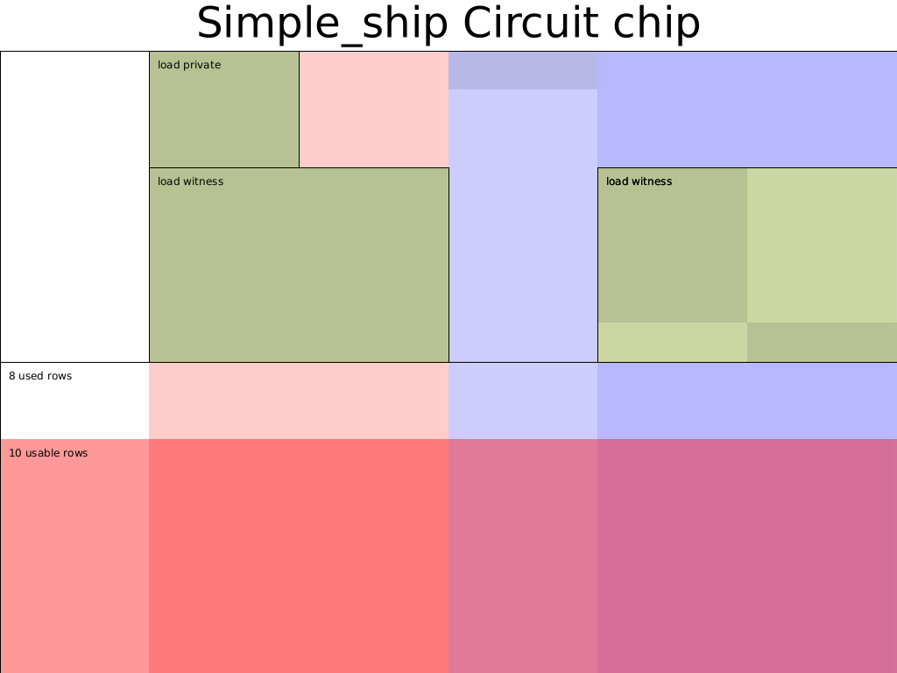

> - 作者:  [@Po@Ethstorage.io](https://github.com/dajuguan)
> - 时间: 2023-10-20
> - 校对:  [@Demian](https://github.com/demian101)

本节我们以一个简单的电路为例，介绍 Halo2 中的自定义门(custom gates) 和 chip 的概念。

在上一节中，我们使用 Halo2 的API实现了只包含乘法门的简单电路，但是如果有多种 gate 呢，这种情况如何处理?

## Custom gates
在Halo2中可通过自定义门来实现，这里需要回顾下 Halo2 中自定义门的 mental model:

如上式，自定义门可以由任意多种不同的门线性相加构成，每一个门由选择器和门运算逻辑构成，如上式中第一个加法门选择器为$q_{add}$，电路逻辑为$a_2=a_0 + a_1$，Halo2中可以通过`create_gate`创建每个门。不过需要注意的是，看起来这些门之间是独立的，但实际上这些门在最终的电路约束检查中会通过乘以一个随机数`y`，一次行检查一行的witness是否**同时满足所有门**的约束。

### 问题定义

本节则是证明如下电路:
```
private inputs: a,b,const
public inputs: out
a^2 * b^2 = c
d = c + const
out = d^3
```

注意到再 vanilla plonk 中约束的 degree 不能超过 2，即只支持加法门和乘法门，但 halo2 支持通过 Ultra plonk 来实现更高阶数等自定义门。这里我们使用自定义门来实现$out=d^3$这条约束(注: 其实Ultra plonk中乘法门和加法门也可以看作自定义门，因此下文我们将该这条三次方约束的门称为**立方门**)，相比于需要两条乘法门实现改约束，自定义门可以减少约束的行数。

因此，我们可以画出电路witness表格:

| ins   | a0    | a1    | s_mul | s_add | s_cub |
|-------|-------|-------|-------|-------|-------|
|  out  |    a  |       |       |       |       |
|       |    b  |       |       |       |       |
|       | const |       |       |       |       |
|       |   ab  |   b   |   1   |   0   |   0   |
|       |   ab  |       |   0   |   0   |   0   |
|       |   ab  |   ab  |   1   |   0   |   0   |
|       | absq  |       |   0   |   0   |   0   |
|       |  absq | const |   1   |   0   |   0   |
|       |  c    |       |   0   |   0   |   0   |
|       |  c    | const |   0   |   1   |   0   |
|       |  d    |       |   0   |   0   |   0   |
|       |  d    |  out  |   0   |   0   |   1   |

> 完整代码见[Halo2 tutotials: chap_2/custom_gates](https://github.com/zkp-co-learning/halo2-step-by-step/blob/main/halo2-tutorials/src/chap_2/exercise_1.rs)

### Config

首先，需要明确电路配置，即所需的Advices,Selectors和Instance列，并创建相应的门。
```rust
#[derive(Debug, Clone)]
struct CircuitConfig {
    advice: [Column<Advice>;2],
    instance: Column<Instance>,
    s_mul: Selector,
    s_add: Selector,
    s_cub: Selector,
}

impl <F:Field> Circuit<F> for MyCircuit<F> {
    type Config = CircuitConfig;
    type FloorPlanner = SimpleFloorPlanner;

    fn without_witnesses(&self) -> Self {
        Self::default()
    }

    fn configure(meta: &mut ConstraintSystem<F>) -> Self::Config {
        let advice = [meta.advice_column(),meta.advice_column()];
        let instance = meta.instance_column();
        let constant = meta.fixed_column();

        meta.enable_equality(instance);
        meta.enable_constant(constant);
        for c in &advice {
            meta.enable_equality(*c);
        }
        let s_mul = meta.selector();
        let s_add = meta.selector();
        let s_cub = meta.selector();

        meta.create_gate("mul_gate", |meta| {
            let lhs = meta.query_advice(advice[0], Rotation::cur());
            let rhs = meta.query_advice(advice[1], Rotation::cur());
            let out = meta.query_advice(advice[0], Rotation::next());
            let s_mul = meta.query_selector(s_mul);
            Constraints::with_selector(s_mul, vec![(lhs * rhs - out)])
        });

        meta.create_gate("add_gate", |meta| {
            let lhs = meta.query_advice(advice[0], Rotation::cur());
            let rhs = meta.query_advice(advice[1], Rotation::cur());
            let out = meta.query_advice(advice[0], Rotation::next());
            let s_add = meta.query_selector(s_add);
            Constraints::with_selector(s_add, vec![(lhs + rhs - out)])
        });

        meta.create_gate("cub_gate", |meta| {
            let lhs = meta.query_advice(advice[0], Rotation::cur());
            let out = meta.query_advice(advice[1], Rotation::cur());
            let s_cub = meta.query_selector(s_cub);
            Constraints::with_selector(s_cub, vec![(lhs.clone()*lhs.clone()*lhs - out)])
        });

        CircuitConfig {
            advice,
            instance,
            s_mul,
            s_add,
            s_cub
        }
    }
    ...
}

```

这里我们使用了`Constraints::with_selector` API，等价于直接返回`vec![selecter * gate expression]`。

### 填入Witness

除了上节的加法门和乘法门之外，我们需要为立方运算增加一个填witness的辅助函数:

```rust
...
fn cub<F:Field>(
    config: &CircuitConfig,
    mut layouter: impl Layouter<F>,
    a: Number<F>,
) -> Result<Number<F>, Error> {
    layouter.assign_region(
        || "cub", 
    |mut region| {
        config.s_cub.enable(&mut region, 0)?;
        a.0.copy_advice(|| "lhs", &mut region, config.advice[0], 0)?;
        let value = a.0.value().copied()*a.0.value().copied()*a.0.value().copied();
        region.assign_advice(|| "out=lhs^3", config.advice[1], 0, || value)
        .map(Number)
    })
}
...

```

> 注意: 推导并填入witness的方式一定要与上述自定义门中引用的单元格和计算方式一致，否则会导致欠约束或约束错误。

然后补充Circuit Trait中的synthesis函数:

```rust
impl <F:Field> Circuit<F> for MyCircuit<F> {
    ...
    fn synthesize(&self, config: Self::Config, mut layouter: impl Layouter<F>) -> Result<(), Error> {
        let a = load_private(&config,layouter.namespace(|| "load a"), self.a)?;
        let b = load_private(&config,layouter.namespace(|| "load b"), self.b)?;
        let constant = load_constant(&config,layouter.namespace(|| "load constant"), self.constant)?;


        let ab = mul(&config,layouter.namespace(|| "a*b"), a, b)?;
        let absq = mul(&config,layouter.namespace(|| "ab*ab"), ab.clone(), ab)?;
        let c = mul(&config, layouter.namespace(|| "absq*constant"), absq, constant.clone())?;

        let d = add(&config, layouter.namespace(|| "absq + constant"), c, constant)?;
        let out = cub(&config, layouter.namespace(|| "absq^3"), d)?;

        //expose public
        layouter.namespace(|| "expose out").constrain_instance(out.0.cell(), config.instance, 0)
    }
}

```

### 测试

实例化电路，并调用相应的Mock Prover来验证。

```rust
cargo test test_simple_3gates
```
输出相应的电路布局图`cargo test plot_3gates_circuit --features dev-graph`:


> 可以看出Halo2的Simple Layouter对乘法门选择器(`s_mul`)和加法门选择器(`s_add`)做了优化，将这两列合并为了1列。

## Chip
在上述实现中，我们填入witness的函数和Config是分离的，为了更好地复用这些代码，类似于集成电路由很多个Chip构成，Halo2一般将一系列紧密相关的实现特定约束的函数(config以及相应的提供witness的函数)抽象到一个Chip模块。

Chips可以进行组合，底层的Chip尽量使用不同的列(当然也允许Chip共享使用相同的列)。在进行电路设计时应尝试优化所需的Advice列，引入这会影响Proof大小。

我们可以将本节中的约束抽象为`SimpleChip`,将原来独立的assign witness的几个函数(`load_private`、`load_constant`、`add`、`mul`和`cub`)合并到Simple Chip的assign方法中。此外，采用如下电路布局压缩所需的行数(在电路中我们只划分了了两个大的region，这样减小了复制`ab`、`absq`、`c`和`c`这四个约束):

| ins   | a0    | a1    | s_mul | s_add | s_cub |
| ------|-------|-------|-------|-------|-------|
| out   |    a  |       |       |       |       |
|       |    b  |       |       |       |       |
|       | const |       |       |       |       |
|       |   a   |   b   |   1   |   0   |   0   |
|       |   ab  |   ab  |   1   |   0   |   0   |
|       | absq  | const |   1   |   0   |   0   |
|       |  c    | const |   0   |   1   |   0   |
|       |  d    |   out |   0   |   0   |   1   |

完整代码见[Halo2 tutorials: chap_2/simple_chip](https://github.com/zkp-co-learning/
halo2-step-by-step/blob/main/halo2-tutorials/src/chap_2/exercise_2.rs)

### test & 输出电路布局图

```rust
cargo test test_simple_ship
cargo test plot_chip_circuit --features dev-grap
```
采用Chip的电路布局图为:

