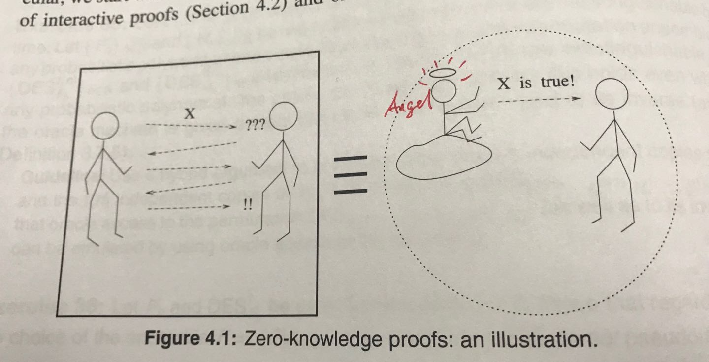
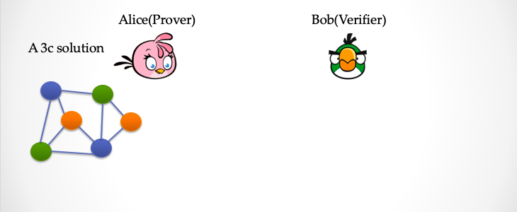
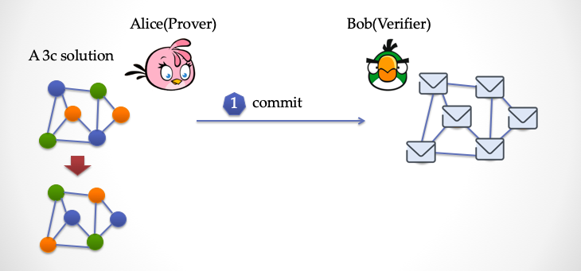
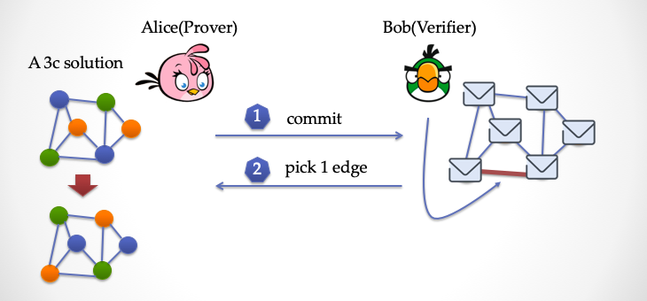
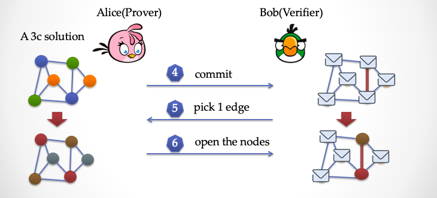

#  初识「零知识」与「证明」

*探索零知识证明系列（一）*

[TOC]

## 引言：

我认为区块链很难称为一个“技术”。它更像是一个领域，包罗万象。或者形而上地说，区块链更像一个有机体，融合了各种不同的理论技术。

零知识证明是构建信任的重要技术，也是区块链这个有机体中不可缺少的一环。

> 零知识证明是打通链上数据与链下计算的关键技术，也是实现链上数据隐私保护的重要途径

要解释「零知识证明」，我们需要先解释「证明」，然后解释什么是「知识」，最后再解释什么是「零知识」。

提醒：文章内容难免有不准确或不严谨的描述，还请各位专业人士拨冗指正。

本文将在 [Github](https://github.com/sec-bit/learning-zkp/) 进行更新与修正。

## "证明" 的前世今生

什么是证明？很多人可能和我一样，看到这两个字，会不禁想起中学考卷中各种三角相似的几何图形，当老师在神奇地画出一条辅助线后，证明过程突然显而易见，然后会懊悔自己为何没想到。

#### 古希腊：「证明」 == 「洞见」

数学证明最早源于古希腊。他们发明（发现）了公理与逻辑，他们用证明来说服对方，而不是靠权威。这是彻头彻尾的「去中心化」。自古希腊以降，这种方法论影响了整个人类文明的进程。

上图是「勾股定理」的巧妙证明。历史上曾出现过许许多多精巧的证明，神奇的思路，天才的灵感。一旦一个命题被证明，上帝都无能为力。嗯，对了，还有那个「上帝不是万能的」证明：上帝不能造出一块他举不起来的石头。

一个数学证明往往暗藏无比深刻的「洞见」，相信很多人都看过「费马大定理」的故事[1]，这个定理证明横跨四百年，从费马写下「这里空间太小，我写不下」，到怀尔斯最终登顶，耗费了许多代人的聪明才智。最近如「彭加莱猜想」，稍微带点年代感的如「哥德巴赫猜想」，还有我非常敬佩的华裔科学家张益唐十年磨一剑，在仔细研究了「Goldston-Pintz-Yıldırım」和 「Bombieri-Friedlander-Iwaniec.」的证明「洞见」之后，证明了「质数间的有界间隔」[2]。

自十七世纪，莱布尼茨起，人们就梦想找到一种机械的手段，可以来自动完成证明，而不再依赖天才的灵光一现。

####  二十世纪初：「证明」 == 「符号推理」

时间到了十九世纪末，康托、布尔、弗雷格、希尔伯特、罗素、布劳威、哥德尔等人定义了形式化逻辑的符号系统。而「证明」则是在利用形式化逻辑的符号语言编写的推理过程。逻辑本身靠谱么？逻辑本身「自恰」吗？逻辑推理本身对不对，能够证明吗？这让 数学家/逻辑学家/计算机科学家 发明（发现） 了符号系统，语法 vs. 语义，可靠 vs. 完备，递归 vs. 无穷。（这部分精彩故事请参看『逻辑的引擎』一书[3]）。

1910年，罗素发表了洪(zhuan)荒(tou)巨著『数学原理』。在书中，罗素与怀特海试图将数学完整地「形式化」下来。如果能达到这样的目标，所有的数学成果都将以证明的方式建立在坚实的基础上。下图就是『数学原理（卷二）』中的一页：

其中`110.643`这是一个命题：「1+1=2」，然后接下来就是这个定理的证明。大家可能奇怪，难道 1+1 还需要证明吗？是的，在数学原理一书中，数字 0，1，2，…… 都有严格定义，「加法」、「乘法」、「等于」都要严格定义，然后每一步的推理都需要指出依据。证明意味着什么？证明是可能繁琐无比的、但是每一步推理都严格无误。书中大量的证明都机械式的，按照公理和推理规则进行一种证明的构造，寻找证明就好像可以交给一个人，然后他无脑在公理与推理规则的集合中进行机械查找。

似乎人们距离「定理的自动证明」并不遥远了。

不幸的是，哥德尔在 1931 年证明了「哥德尔不完备性定理」[4]，图灵在 1936 年证明了图灵机停机问题的不可判定性[5]。这些成果彻底终结了这个几百年的幻想。无论公理系统如何精巧设计，都无法抓住所有的真理。

证明不仅仅是一个严格推理，而且凝结了似乎很难机械化的创造性思维。证明中蕴含了大量的「知识」，每一次的突破，都将我们的认知提升到一个新的高度。不管是「洞见」，还是推理过程中所构造的「算法」，一个定理的证明的内涵往往远超出定理本身的结论。

#### 六十年代：「证明」 == 「程序」

又过了半个世纪，到了六十年代，逻辑学家 Haskell Curry 和 William Howard 相继发现了在「逻辑系统」和「计算系统— Lambda 演算」中出现了很多「神奇的对应」，这就是后来被命名的「Curry-Howard Correspondence」。这个发现使得大家恍然大悟，「编写程序」和「编写证明」实际在概念上是完全统一的。而在这之后的 50 年，相关理论与技术发展使得证明不再停留在草稿纸上，而是可以用程序来表达。这个同构映射非常有趣：程序的类型对应于证明的定理；循环对应于归纳；……（这里推荐一本书：『软件基础』（Software Foundations 中译本）[6]）。在直觉主义框架中，证明就意味着构造算法，构造算法实际上就是在写代码。(反过来也成立，嗯，码农码的不是代码，是数学证明，:P)

目前在计算机科学领域，许多理论的证明已经从纸上的草图变成了代码的形式，比较流行的「证明编程语言」有 Coq，Isabelle，Agda 等等。采用编程的方式来构造证明，证明的正确性检查可以机械地由程序完成，并且许多啰嗦重复性的劳动可以由程序来辅助完成。数学理论证明的大厦正在像计算机软件一样，逐步地构建过程中。1996 年 12 月 W. McCune 利用自动定理证明工具 EQP 证明了一个 长达 63 年历史的数学猜想「Ronbins 猜想」，『纽约时报』随后发表了一篇题为「Computer Math Proof Shows Reasoning Power」的文章[7]，再一次探讨机器能否代替人类创造性思维的可能性。

利用机器的辅助确实能够有效帮助数学家的思维达到更多的未知空间，但是「寻找证明」仍然是最有挑战性的工作。「验证证明」，则必须是一个简单、机械、并且有限的工作。这是种天然的「不对称性」。

####  八十年代：「证明」 == 「交互」

时间拨到1985年，乔布斯刚刚离开苹果，而 S. Goldwasser 博士毕业后来到了 MIT，与 S. Micali，Rackoff 合写了一篇能载入计算机科学史册的经典：『交互式证明系统中的知识复杂性』[8]。

他们对「证明」一词进行了重新的诠释，并提出了交互式证明系统的概念：通过构造两个图灵机进行「交互」而不是「推理」，来证明一个命题在概率上是否成立。「证明」这个概念再一次被拓展。

交互证明的表现形式是两个（或者多个图灵机）的「对话脚本」，或者称为 Transcript。而这个对话过程，其中有一个显式的「证明者」角色，还有一个显式的「验证者」。其中证明者向验证者证明一个命题成立，同时还「不泄露其他任何知识」。这种就被称为「零知识证明」。

再强调一遍，证明凝结了「知识」，但是证明过程确可以不泄露「知识」，同时这个证明验证过程仍然保持了简单、机械，并且有限性。这听上去是不是有点「反直觉」？

## 交互式证明

Alice: 我想向你证明我有一个方程的解，`w^3 - （w+1)^2 + 7 = 0` （方程的解：`w=3`）

Bob: 好啊，我听着呢

Alice: 但是我不会告诉你 x 具体是多少，除非你愿意掏钱，我才告诉你。

Bob: 可以啊，但是你要先证明你有方程的解，我再给钱你。

Alice: @#$%^& （黑科技）

Bob:  ?????? （黑科技）

Alice: &*#$@! （黑科技）

Bob: ??????（黑科技）

...... （继续黑科技）

Alice: 好了，完了

Bob: 好吧，你确实有方程的解，不过是不是我掏了钱，你就会把答案告诉我？

Alice: 别废话，掏钱！

上面例子就是一个「交互式证明」。假设Alice知道方程的解， `f(w) = 0`，那么 Alice 如何让 Bob 确信她知道 `w` 呢？Alice 在 「黑科技阶段」 告诉了 Bob 一大堆的信息。好了，关键问题是，Bob 能不能从 Alice 所说的一大堆信息中猜出`w` 到底是几，或者能分析出关于 `w` 的蛛丝马迹呢？如果 Bob 有这个能力，Bob也许就没必要掏钱了，因为他已经获得了这个值钱的信息。

请注意，如果 Alice 与 Bob 的对话是 「零知识」 的，那么 Bob 除了知道 `w` 是 `f(w)=0` 的解之外，不能获取其它任何关于 `w` 的信息。 这一点非常重要，这是保护 Alice 的利益。

现在回顾一下「零知识证明」这个词，英文叫 「Zero-Knowledge Proof」 。这个词包含三个关键部分：

+ `零`
+ `知识`
+ `证明`

各位可能已经有点感觉了，我们来尝试着解读一下：

+ 零： Alice 泄露了关于 `w` 的「零」知识，也就是没有泄露知识。
+ 知识：这里就是指的就是 `w`。
+ 证明：就是Alice与Bob对话中的「黑科技部分」。

好了，证明也就是黑科技部分还没讲。看官们不要急，且听我慢慢道来。

## 零知识证明有什么用处？

一提零知识证明技术，很多人就想到了匿名 Coin，比如 Monero, 比如 ZCash。确实，这几个 Coin 很好地普及了零知识证明，我本人也是通过 ZCash 才第一次听说了零知识证明这个词。但是在更深入地了解这个技术之后，深深感觉这个技术的威力远不止这一点。

> 零知识证明技术可以解决数据的信任问题，计算的信任问题！

张三说他有100块钱，李四说他北大毕业，王五说要和八菲特共进午餐。空口无凭，`Show me the proof`。

那么「零知识证明」能解决数据的信任如何理解呢？在上一篇文章『zkPoD: 区块链，零知识证明与形式化验证，实现无中介、零信任的公平交易』[9]里面，我提到了一个概念「模拟」：

> 零知识证明技术可以「模拟」出一个第三方，来保证某一个论断是可信的

换句话说，当我们收到一个加了密的数据， 然后还有一个零知识证明。这个零知识证明是说 「关于数据的 X 断言成立」，那么这等价于有一个天使在我们耳边悄声说，「关于数据的X 断言成立」！

对于这个 `X 断言`，可以非常灵活，它可以是一个 `NP`复杂度的算法。大白话讲只要我们能写一段程序（一个多项式时间的算法）来判断一个数据是否满足 `X 断言`，那么这个断言就可以用零知识证明的方式来表达。通俗点讲，只要数据判定是客观的，那么就零知识证明就适用。

零知识证明的一些用处：

+ 数据的隐私保护：在一个数据表格中，多多少少都有一些信息不想被暴露，比如当年我的成绩单，我只想向人证明，我的成绩及格了，但是我不想让别人知道我到底考了61分还是62分，这会很尴尬。我没有心脏病，但是保险公司需要了解这一点，但是我不想让保险公司知道我的隐私信息。那我可以证明给保险公司看，我没有心脏病，但是病历的全部并不需要暴露。我是一家企业，我想向银行贷款，我只想向银行证明我具备健康的业务与还款能力，但是我不想让银行知道我们的一些商业秘密。
+ 计算压缩与区块链扩容：在众多的区块链扩容技术中，Vitalik 采用 zkSNARK 技术能够给现有的以太坊框架带来几十倍的性能提升。因为有了计算的证明，同样一个计算就没必要重复多次了，在传统的区块链架构中，同样的计算被重复多次，比如签名的校验，交易合法性校验，智能合约的执行等等。这些计算过程都可以被零知识证明技术进行压缩。
+ 端到端的通讯加密：用户之间可以互相发消息，但是不用担心服务器拿到所有的消息记录，同时消息也可以按照服务器的要求，出示相应的零知识证明，比如消息的来源、与发送的目的地。
+ 身份认证：用户可以向网站证明，他拥有私钥，或者知道某个只要用户自己才知道的秘密答案，而网站并不需要知道，但是网站可以通过验证这个零知识证明， 从而确认用户的身份
+ 去中心化存储：服务器可以向用户证明他们的数据被妥善保存，并且不泄露数据的任何内容。
+ 信用记录：信用记录是另一个可以充分发挥零知识证明优势的领域，用户可以有选择性的向另一方出示自己的信用记录，一方面可以有选择的出示满足对方要求的记录分数，同时证明信用记录的真实性。
+ 构造完全公平的线上数字化商品的交易协议[9]。
+ 更多的例子，可以是任何形式的数据共享，数据处理与数据传输。

## 举例：地图三染色问题

下面讲一个经典的问题，地图的三染色问题。如何用三种颜色染色一个地图，保证任意两个相邻的地区都是不同的颜色。我们把这个「地图三染色问题」转变成一个「连通图的顶点三染色问题」。假设每个地区都有一个首府（节点），然后把相邻的节点连接起来，这样地图染色问题可以变成一个连通图的顶点染色问题。

下面我们设计一个交互协议：

+ 「证明者」Alice
+ 「验证者」 Bob

Alice 手里有一个地图三染色的答案，请见下图。这个图总共有 6 个顶点，9 条边。

现在 Alice 想证明给 Bob 她有答案，但是又不想让 Bob 知道这个答案。Alice 要怎么做呢？

Alice 先要对染过色的图进行一些「变换」，把颜色做一次大挪移，例如把所有的绿色变成橙色，把所有的蓝色变成绿色，把所有的橙色变成蓝色。然后 Alice  得到了一个新的染色答案，这时候她把新的图的每一个顶点都用纸片盖上，然后出示给 Bob 看。

看下图，这时候 Bob 要出手了（请见下图），他要随机挑选一条「边」，注意是随机，不让 Alice 提前预测到的随机数。

假设 Bob 挑选的是最下面的一条边，然后告诉 Alice。

这时候 Alice 揭开这条边两端的纸片，让 Bob 检查，Bob 发现这两个顶点的颜色是不同的，那么 Bob 认为这次检验同构。这时候，Bob 只看到了图的局部，能被说服剩下的图顶点的染色都没问题吗？你肯定觉得这远远不够，也许恰好 Alice 蒙对了呢？其它没暴露的顶点可能是胡乱染色的。

没关系，Bob 可以要求 Alice 再来一遍，看下图

Alice 再次把颜色做一次变换，把蓝色改成紫色，改绿色改成棕色，把橙色改成灰色，然后把所有的顶点盖上纸片。然后 Bob 再挑选一条边，比如像上图一样，选择的是一条竖着的边，然后让 Alice 揭开纸片看看，如果这时候 Bob 再次发现这条边两端的顶点颜色不同，那么 Bob 这时候已经有点动摇了，可能 Alice 真的有这个染色答案。可是，两次仍然不够，Bob 还想再多来几遍。

那么经过反复多次重复这三个步骤，可以让 Alice 作弊并能成功骗过 Bob 的概率会以指数级的方式减小。假设经过 `n` 轮之后，Alice 作弊的概率为
$$
Pr[(G, c)\ | \ ThreeColor(G, c) = 0] < (1 - \frac{1}{|E|})^n
$$

这里 `|E|` 是图中所有边的个数， 如果 `n` 足够大，这个概率 `Pr` 会变得非常非常小，变得「微不足道」。

可是，Bob 每次看到的局部染色情况都是 Alice 变换过后的结果，无论 Bob 看多少次，都不能拼出一个完整的三染色答案出来。实际上，Bob 在这个过程中，虽然获得了很多「信息」，但是却没有获得真正的「知识」。

## 信息 vs. 知识

+ 信息 「Information」
+ 知识 「Knowledge」

在地图三染色问题的交互证明中，当重复交互很多次之后，Bob 得到了大量的信息，但是这好比 Alice 发给 Bob 一堆随机数一样，Bob 并没有「知道」更多的东西。打个比方，如果 Alice 告诉 Bob 「1+1=2」，Bob 得到了这个信息，可是 Bob 并没有额外获取更多的「知识」，因为这个事实人人皆知。

假如 Alice 告诉 Bob `2^2^41-1`这个数是一个质数，很显然这个是「知识」，因为要算出来这个数是不是一个质数，这需要耗费大量的算力。

假如 Alice 告诉 Bob，总共有两个顶点用了绿颜色，那么 Bob 就获得了宝贵的「知识」，因为基于他刚刚获取的这个信息，Bob 可以用更短的时间用一台图灵机去求解三染色问题。假如 Alice 又透露给 Bob，最左边的顶点颜色是用橙色，那么很显然，这个「信息」对于 Bob 求解问题并没有实质上的帮助。

我们可以尝试定义一下，如果 Bob 在交互过程中获得的「信息」，可以帮助提升 Bob 直接破解 Alice 秘密的能力，那么我们说 Bob 「获得了知识」。由此可见，知识这个词的定义与 Bob 的计算能力相关，如果信息并不能增加 Bob 的计算能力，那么信息不能被称为「知识」。比如在 Alice 与 Bob 交互过程中，Alice 每次都掷一个硬币，然后告诉 Bob 结果，从信息角度看，Bob 得到的信息只是一个「事件」，然而 Bob 并没有得到任何「知识」，因为 Bob 完全可以自己来掷硬币。

下面引用『Foundations of Cryptography—— Basic Tools』一书[10]中的总结

> 1. 「知识」是与「计算难度」相关，而「信息」则不是
>
> 2. 「知识」是与公共所知的东西有关，而「信息」主要与部分公开的东西有关

注：曾有人问我，这里的信息与知识的定义是否与 Kolmogorov 复杂性有关。根据算法信息论，一段字符串的信息量可以用产生字符串的最小程序的长度来测量。这个问题我不是很懂，希望路过的专业人士留言。

## 可验证计算与电路可满足性问题

看了上面的地图三染色问题，大家是不是没有感觉，好像这只是一个学术问题，如何跟现实问题关联起来？地图三染色问题是一个 NP-Complete 问题，这是「计算理论」中的一个名词。另外有一个叫做「电路可满足问题」也是同样是 NP-Complete 问题。NP-Complete 是一类问题，他的求解过程是多项式时间内难以完成的，即「求解困难」，但是验证解的过程是多项式时间可以完成的，即「验证简单」。

那什么是电路呢？下面是三个不同的「算术电路」：

可以看到一个电路由很多个门组成，其中有加法门，还有乘法门。每一个门有几个输入引脚，有几个输出引脚。每一个门做一次加法运算，或乘法运算。别看这么简单，我们平时跑的（没有死循环）代码，都可以用算术电路来表示。

这意味着什么呢？我们下面结合「零知识证明」与「电路可满足性问题」来试着解决数据的隐私保护问题。

下面请思考一个场景：Bob 交给 Alice 一段代码 `P`，和一个输入 `x`，让 Alice 来运行一遍，然后把运行结果告诉 Bob。可能这个计算需要消耗资源，而 Bob 把计算过程外包给了 Alice。然后 Alice 运行了一遍，得到了结果 `y`。然后把 `y` 告诉 Bob。下面问题来了：

> 如何让 Bob 在不运行代码的前提下，相信代码 `P` 运行的结果一定是 `y` 呢？ 

这里是思考时间，大家可以想个五分钟 ……

（五分钟后……）

Alice 的一种做法是可以把整个计算过程用手机拍下来，这个视频里面包含了计算机 CPU，还有内存，在整个运行过程中的每一晶体管的状态。很显然这么做是不现实的。那么有没有更可行的方案呢？

答案是 Bob 把程序 `P` 转换成一个完全等价的算术电路，然后把电路交给 Alice。Alice 只要计算这个电路就可以了，然后这个过程是可以用手机拍下来的，或者用纸记下来，如果电路规模没有那么大的话。Alice 只要把参数 6 输入到电路，然后记录下电路在运算过程中，所有与门相连的引脚线上的值。并且最后的电路输出引脚的值等于 `y`，那么 Bob 就能确信 Alice 确实进行了计算。Alice 需要把电路的所有门的输入与输出写到一张纸上，交给 Bob，这张纸就是一个计算证明。

这样 Bob 完全可以在不重复计算电路的情况下来验证这张纸上的证明对不对，验证过程很简单：

**Bob 依次检查每一个门的输入输出能不能满足一个加法等式或者一个乘法等式**。

比如 1 号门是一个加法门，它的两个输入是 3，4，输出是7，那么很容易就知道这个门的计算是正确的。当 Bob 检查完所有的门之后，就能确信：

Alice 确确实实进行了计算，没有作弊。

这张纸上的内容就是「满足」算术电路 `P` 的一个解「Solution」。

> 所谓的电路可满足性就是指，存在满足电路的一个解。如果这个解的输出值等于一个确定值，那么这个解就能「表示」电路的计算过程。

对于 Alice 而言，Bob 如果用这种方式验证，她完全没有作弊的空间。但是这种方法很显然有个弊端：

+ 弊端一：如果电路比较大，那么证明就很大，Bob 检查证明的工作量也很大。
+ 弊端二：Bob 在验证过程中，知道了所有的电路运算细节，包括输入。

#### 黑科技

我们再对刚才的 Alice 与 Bob 的场景做些修改。假如，Alice 自己还有一个秘密，比如说网银密码。而 Bob 想知道 Alice 的网银密码的长度是不是 20 位长。而 Alice 想了下，告诉他密码长度应该问题不大。这时候 Bob 把一个计算字符串长度的代码转换成了电路 Q，并且发给 Alice。Alice 用电路 Q 算了一下自己的密码，然后把电路所有门的引脚发给了 Bob，并带上运算结果 20。

Wai……t，这是有问题的，Bob 拿到电路运算过程中的所有内部细节之后，不就知道密码了吗？是的，Alice 显然不能这么做。那么 Alice 应该怎么做？

答案是有很多种办法，热爱区块链技术的读者最耳熟的就是 zkSNARK[11]，还有zkSTARK[12]，子弹证明BulletProof[13]，以及一些比较小众的技术，都可以帮 Alice 做到：

> Alice 以一种零知识的方式，向 Bob 证明她计算过了电路，并且使用了她的秘密输入。

换句话说，这些「零知识的电路可满足性证明协议」为 Alice 提供了强大的武器来向 Bob 证明她的网银密码长度为 20，并且除此之外， Bob 再也得不到任何其它有用的信息。除了网银密码，Alice 理论上可以向 Bob 证明任何她的隐私数据的某些特性，但是并不暴露任何别的信息。

> 「零知识的电路可满足性证明协议」提供了一种最直接的保护隐私/敏感数据的技术

最近几年来，零知识证明构造技术发展日新月异，并且在区块链技术领域得到了越来越多的应用。最新的零知识证明技术，有的技术可以让 Bob 高速验证证明（在移动设备上几毫秒验证完成）；有的技术可以让所有吃瓜群众帮忙验证（非交互式零知识证明）；有的技术支持非常小的证明大小（小到几十个字节）。后续文章我们会逐步展开介绍。

## 写在最后

无论是精妙的数论定理，地图三染色问题，还是电路可满足性问题。证明存在的意义是什么？所有的证明都体现了「证明」与「验证」的「不对称性」。证明可能是一个非常耗费算力，或者脑力的活动，无论是耗时几百年的「费马大定理」，还是比特币中的 POW 证明，这些证明都凝结了在寻找证明过程中所消耗的能量，证明过程可能是超乎寻常的复杂，偶尔需要天才横空出世。而验证过程一定（或者应该）是一个非常简单的，机械的，在（多项式）有效时间内且能终止的活动。某种意义上，这个不对称性真正体现了证明的意义，展示了零知识证明的价值。

> 粗略看，「证明」是「逻辑」的产物，但「逻辑」与「计算」却又有着密不可分的联系，大家可能模模糊糊感觉到一些关于「证明」与「计算」之间的关联，它们贯穿始终：如机械推理、证明表达、交互计算 。这是一个有趣但更宏大的哲学问题。

### 参考文献

+ [1] 西蒙, 辛格, 薛密. 费马大定理: 一个困惑了世间智者 358 年的谜[M]. 上海译文出版社, 1998.
+ [2]  Alec Wilkinson. The Pursuit of Beauty: Yitang Zhang solves a pure-math mystery. The New Yorker. Feb. 2015.
+ [3] 马丁, 戴维斯, 张卜天. 逻辑的引擎[M]. 湖南科学技术出版社, 2012.
+ [4] Raymond Smullyan. Gödel's Incompleteness Theorems, Oxford Univ.Press. 1991.
+ [5] Turing, Alan. "On computable numbers, with an application to the Entscheidungsproblem." *Proceedings of the London mathematical society* 2.1 (1937): 230-265.
+ [6] Pierce, Benjamin C., et al. "Software foundations." 中文译文: <https://github.com/Coq-zh/SF-zh
+ [7] Kolata, Gina. "Computer math proof shows reasoning power." *Math Horizons* 4.3 (1997): 22-25.
+ [8] Goldwasser, Shafi, Silvio Micali, and Charles Rackoff. "The knowledge complexity of interactive proof systems." *SIAM Journal on computing* 18.1 (1989): 186-208.
+ [9] zkPoD: 区块链，零知识证明与形式化验证，实现无中介、零信任的公平交易. 安比实验室. 2019.
+ [10] Oded, Goldreich. "Foundations of cryptography basic tools." (2001). 
+ [11] Gennaro, Rosario, et al. "Quadratic span programs and succinct NIZKs without PCPs." Annual
  International Conference on the Theory and Applications of Cryptographic Techniques. Springer Berlin, Heidelberg, 2013.
+ [12] Ben-Sasson, Eli, et al. "Scalable, transparent, and post-quantum secure computational integrity." *IACR Cryptology ePrint Archive* 2018 (2018): 46.
+ [13] Bünz, Benedikt, et al. "Bulletproofs: Short proofs for confidential transactions and more." 2018
  IEEE Symposium on Security and Privacy (SP). IEEE, 2018.

